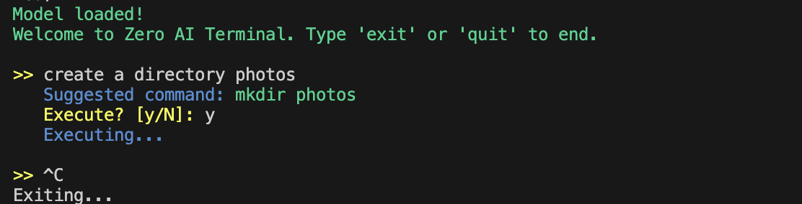
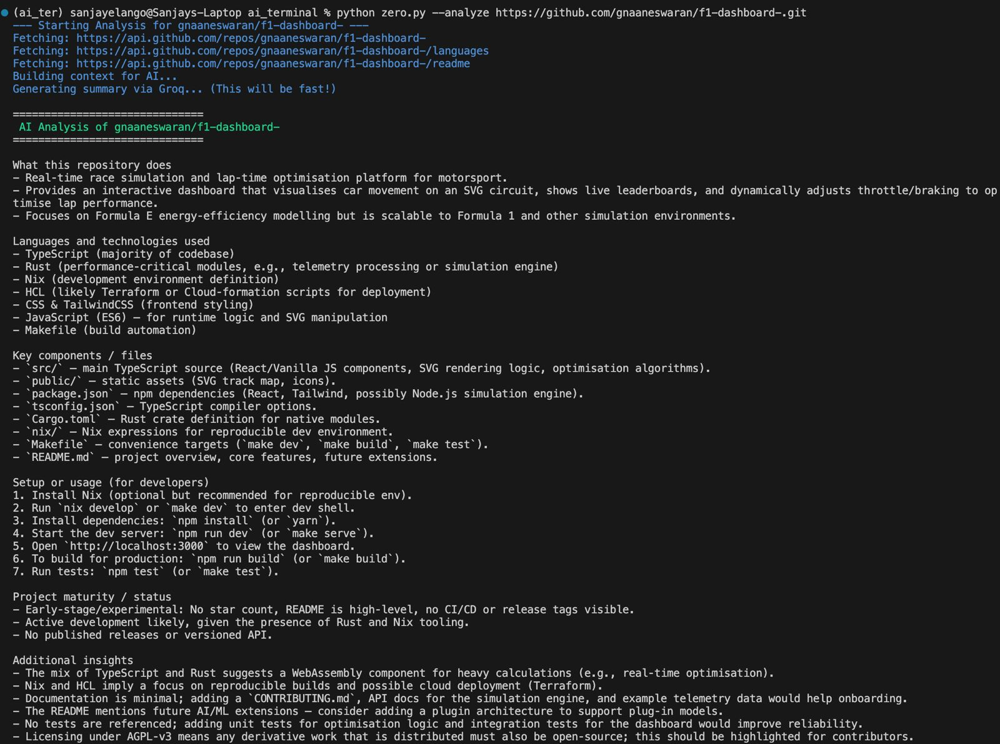

# Zero - An AI-Powered Developer Assistant 🚀

Zero is a multi-tool AI assistant that lives in your terminal. It's designed to be a "second brain" that automates tedious developer tasks, from translating plain English into shell commands to summarizing entire GitHub repositories.

## ✨ Core Features

Zero is built on a modular `tools` architecture, allowing for the easy addition of new capabilities. The current version includes:

| Feature | Command | AI Model Used |
|---------|---------|---------------|
| 1. Interactive Shell | `python zero.py` | Local GGUF (e.g., Phi-3) |
| 2. GitHub Analyzer | `python zero.py --analyze <url>` | Groq API (e.g., Llama 3.1) |
| 3. AI Git Assistant | `python zero.py --git commit` | Groq API (e.g., Llama 3.1) |

## 📸 Demos

### 1. Interactive AI Shell
Run your terminal with natural language. Zero translates your requests into bash commands and asks for confirmation before executing.




### 2. GitHub Repository Analyzer
Get a deep, technical summary of any public GitHub repo in seconds. Zero uses the GitHub API to fetch data and a powerful Groq-based LLM to generate an architect-level analysis.




### 3. Context-Aware AI Git Assistant
Never write a commit message again. `zero` reads your staged changes, branch name, and commit history to generate a perfect, professional, Conventional-standard commit message.


## 🛠️ Tech Stack

* **Core:** Python 3.9+
* **Local LLM Inference:** `llama-cpp-python` for running quantized GGUF models (like Phi-3) locally with GPU/Metal support.
* **Cloud LLM Inference:** `Groq API` for ultra-fast, powerful summarization and generation (using Llama 3.1).
* **CLI Framework:** `argparse` for robust command-line routing.
* **APIs & Automation:** `requests` (for GitHub API), `gitpython` (or `subprocess`), `python-dotenv`.
* **Architecture:** A clean, modular design separating the main router (`zero.py`) from `tools/`, `utils/`, and `prompts/`.

## 🚀 Getting Started

### 1. Clone the Repository
```bash
git clone https://github.com/Sanjayyy06/ai_terminal.git
cd ai_terminal
```

### 2. Create Environment & Install Dependencies
```bash
# Create a virtual environment
python3 -m venv ai_ter
source ai_ter/bin/activate

# Install all required libraries
pip install -r requirements.txt
```

### 3. Set Up API Keys

This project requires a Groq API key for the advanced features.

1. Copy the example environment file:
```bash
   cp .env.example .env
```

2. Get your free API key from [Groq Cloud](https://console.groq.com).

3. Paste your key into the `.env` file you just created.

### 4. Download the Local Model

The interactive shell (`python zero.py`) requires a local GGUF model.

1. Download your trained GGUF model (e.g., `zero-phi3-v1.Q4_K_M.gguf`).
2. Place it inside the `models/` directory.

*(This script is set up to auto-download from `Sanjayyy06/zero-nl2cmds-v1` if the file is not found, but placing it manually is recommended.)*

## 💻 Usage

### 1. Interactive Shell

For translating natural language to bash commands.
```bash
python zero.py
```

**Example:**
```
>> create a folder for my new project
Suggested command: mkdir "my new project"
Execute? [y/N]: y
```

### 2. AI Git Assistant

To generate a commit message based on your staged files.
```bash
# First, stage your changes
git add .

# Then, run the tool
python zero.py --git commit
```

**Example Output:**
```
Analyzing diff... (Branch: main, Type: Refactor)
Suggested commit message:
Refactor: Update tool logic to use Groq Llama 3.1

This commit refactors the git_tool and analyze_tool to use the new...

Commit with this message? [y/N]:
```

### 3. GitHub Repo Analyzer

To get a full summary of any public repository.
```bash
python zero.py --analyze https://github.com/ggerganov/llama.cpp
```

## 📝 License

This project is open source and available under the [MIT License](LICENSE).

## 🤝 Contributing

Contributions, issues, and feature requests are welcome! Feel free to check the [issues page](https://github.com/Sanjayyy06/ai_terminal/issues).

## 👤 Author

**Sanjay**
* GitHub: [@Sanjayyy06](https://github.com/Sanjayyy06)

## ⭐ Show your support

Give a ⭐️ if this project helped you!